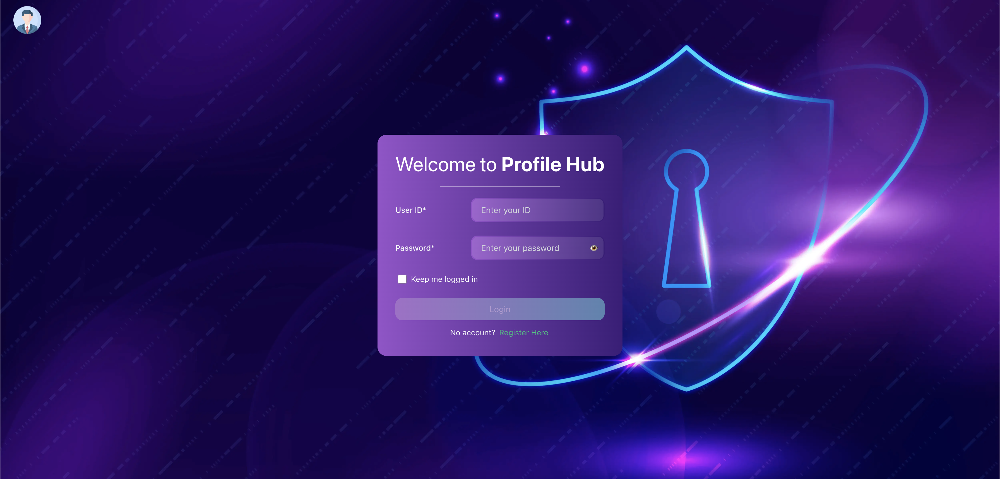
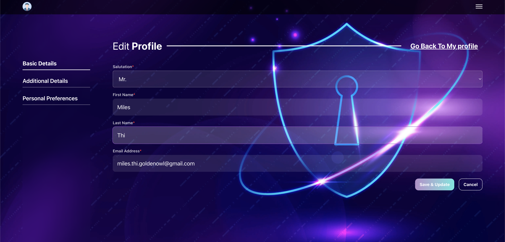

# Profile Hub – User Login & Dashboard

A modern frontend web app with user authentication, dashboard view, and user flow. Built using **Vue + TypeScript + Vite** and API-driven architecture.

---

## ✨ Features

- User registration and login
- User dashboard to view and manage profile data
- Responsive design with smooth UX
- Integration-ready with backend APIs

---

## 📁 Project Structure

```
profilehub/
  src/         # Vue + Vite frontend
    /pages     # Login, Profile, Register pages
    /router
    /component # Reuseable components
```

---

## 🧰 Prerequisites

- **Node.js & yarn** (for local frontend dev)

---

## 🚀 Local Development

```bash
cp .env.example .env
yarn
yarn dev
```

- The frontend will run at http://localhost:3000

---

## Environment Variables

- `VITE_API_BASE_URL` — The base URL for the backend API (e.g., `http://localhost:8000` or your production URL)

---

## Deployment Notes

- For production, set `VITE_API_BASE_URL` to your backend's public URL in your deployment environment.
- Rebuild the frontend after changing environment variables.

---

## Production URL

`https://profile-hub-roan.vercel.app/`

---


## Test Account (after seeding)

If you run the database seed command, a default test account will be created:

```bash
UserId:   michaels
password: Jackson@123
```

You can use this account to log in and test the system.
Alternatively, you can register a new account via the frontend if needed.

---

## Screenshots






## License

MIT
